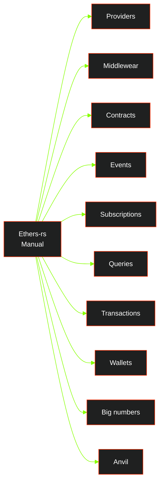

# Intro
Welcome to the hands-on guide for the ethers-rs library!

This documentation contains a collection of examples demonstrating how to use the library to build Ethereum-based applications in Rust. The examples cover a range of topics, from basic smart contract interactions to more advanced usage of ethers-rs.

```admonish info 
You can find the official ethers-rs documentation on docs.rs - [here](https://docs.rs/ethers/0.5.0/ethers/).
```

Each example includes a detailed description of the functionality being demonstrated, as well as complete code snippets that you can use as a starting point for your own projects.

We hope that these docs will help you get started with ethers-rs and give you a better understanding of how to use the library to build your own web3 applications in Rust. If you have any questions or need further assistance, please don't hesitate to reach out to the ethers-rs community.

The following is a brief overview diagram of the  topis covered in this guide.


```admonish bug 
This diagram is incomplete and will undergo continuous changes.
```
