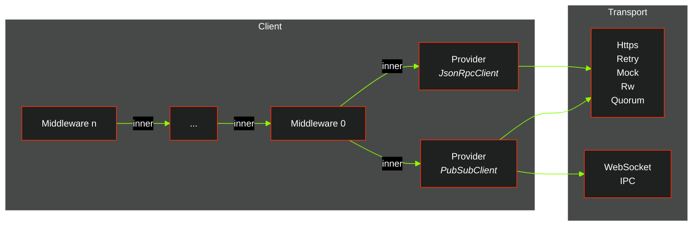

# Middlewares
In ethers-rs, middleware is a way to customize the behavior of certain aspects of the library by
injecting custom logic into the process of interacting with the Ethereum JSON-RPC API.
Middlewares act in a chain of responsibility and can be combined to achieve the desired behavior. 

The library allows developers to create [custom middlewares](./custom.md), going beyond
standard operations and unlocking powerful use cases.

A JSON-RPC client instance can be constructed as a stack of middlewares, backed by a common instance of `Provider` of one specific type among `JsonRpcClient` and `PubSubClient`. 

The following middlewares are currently supported:

- [Gas Escalator](./gas-escalator.md): Avoids transactions being stucked in the mempool, by bumping the gas price in background.
- [Gas Oracle](./gas-oracle.md): Allows retrieving the current gas price from common RESTful APIs, instead of retrieving it from blocks.
- [Nonce Manager](./nonce-manager.md): Manages nonces of transactions locally, without waiting for them to hit the mempool.
- [Policy](./policy.md): Allows to define rules or policies that should be followed when submitting JSON-RPC API calls.
- [Signer](./signer.md): Signs transactions locally, with a private key or a hardware wallet.
- [Time lag](./time-lag.md): Poses a block delay on JSON-RPC interactions, allowing to shift the block number back of a predefined offset.
- [Transformer](./transformer.md): Allows intercepting and
  transforming a transaction to be broadcasted via a proxy wallet.